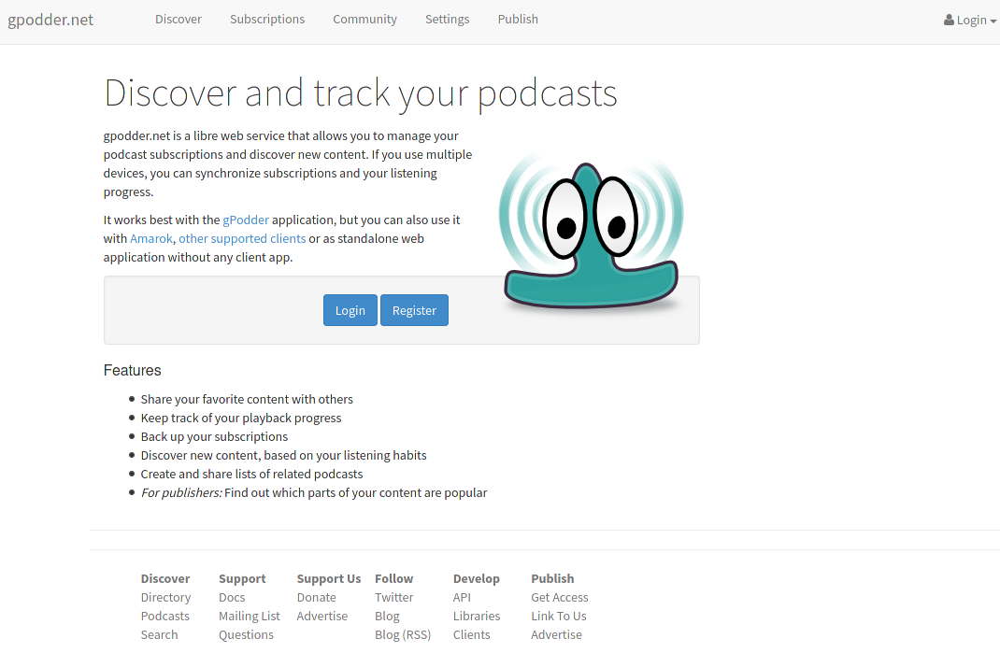

<!--
N.B.: This README was automatically generated by https://github.com/YunoHost/apps/tree/master/tools/README-generator
It shall NOT be edited by hand.
-->

# mygpo (gPodder.net) for YunoHost

[](https://dash.yunohost.org/appci/app/mygpo)    
[](https://install-app.yunohost.org/?app=mygpo)

*[Lire ce readme en français.](./README_fr.md)*

> *This package allows you to install mygpo (gPodder.net) quickly and simply on a YunoHost server.
If you don't have YunoHost, please consult [the guide](https://yunohost.org/#/install) to learn how to install it.*

## Overview

This is the webservice powering the https://gpodder.net website. It can be used to sync podcast subscriptions with [supported clients](https://gpoddernet.readthedocs.io/en/latest/user/clients.html).


**Shipped version:** 2.11.20220622~ynh1

**Demo:** https://gpodder.net

## Screenshots



## Disclaimers / important information

## Limitations

* The feed-parsing service is not included, https://feeds.gpodder.net is used

## Configuration

Edit files under `/opt/yunohost/APPDIR/envs/prod` to set environment variables. There is an admin interface at `yourdomain.tld/admin` that the admin user can log in to.

## Documentation and resources

* Official app website: <https://gpodder.net>
* Official admin documentation: <https://gpoddernet.readthedocs.io/>
* Upstream app code repository: <https://github.com/gpodder/mygpo>
* YunoHost documentation for this app: <https://yunohost.org/app_mygpo>
* Report a bug: <https://github.com/YunoHost-Apps/mygpo_ynh/issues>

## Developer info

Please send your pull request to the [testing branch](https://github.com/YunoHost-Apps/mygpo_ynh/tree/testing).

To try the testing branch, please proceed like that.

``` bash
sudo yunohost app install https://github.com/YunoHost-Apps/mygpo_ynh/tree/testing --debug
or
sudo yunohost app upgrade mygpo -u https://github.com/YunoHost-Apps/mygpo_ynh/tree/testing --debug
```

**More info regarding app packaging:** <https://yunohost.org/packaging_apps>
